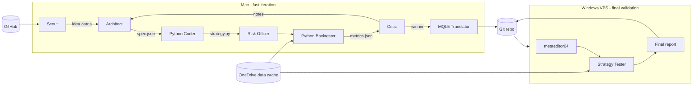

# MT5 Adaptive EA Agent Factory

A multi-agent system that designs, codes, backtests, critiques, and rewrites MetaTrader 5 Expert Advisors for **XAUUSD** and **GER40** on **M5** and **M15**, with strict walk-forward validation.

The iteration loop runs **locally on Mac** using a fast Python backtester (seconds per run). Only the final surviving candidate is translated to MQL5 and validated on the **Windows VPS** running MT5 (hours per run).

## Why this design

- MT5 Strategy Tester on every-tick data is authoritative but slow. Using it as the inner-loop signal burns VPS hours.
- A Python pre-filter gives us hundreds of cheap iterations per day. The VPS becomes a pass/fail oracle for finished candidates only.
- Parity between the Python and MQL5 code paths is enforced by shared primitives, a deterministic `spec.json`, and a bar-by-bar parity diff.

## Architecture at a glance



## Agents

| Agent | Runs where | Responsibility |
|-------|------------|----------------|
| **Scout** | Mac | Mines GitHub for MQL5 EAs, indicators, and trading strategies. Produces distilled idea cards with license verdicts; never copies code without permissive licensing. |
| **Architect** | Mac | Propose 3-5 diverse candidate strategy specs per generation as JSON. Consumes Scout idea cards and prior art. |
| **Python Coder** | Mac | Implement each spec as a `strategy.py` using shared primitives. |
| **Risk Officer** | Mac | Static-check each candidate for SL, sizing, anti-martingale, spread filter. |
| **Backtester** | Mac | Run IS backtest on 4 combos (XAUUSD / GER40 x M5 / M15), then OOS walk-forward on survivors. |
| **Critic** | Mac | Rank candidates by multi-objective fitness, write refinement notes. |
| **MQL5 Translator** | Mac | Only runs on the accepted winner. Emits `EA.mq5` + parity harness. |
| **VPS Validator** | Windows | Compile and run the accepted EA in MT5 Strategy Tester, confirm or reject. |

## Symbols, timeframes, and windows

- **Symbols**: XAUUSD, GER40 (adjust symbol name per broker in `config.yaml`).
- **Timeframes**: M5 and M15 (every candidate is tested on all 4 combos; we reward consistency).
- **In-sample**: 2020-01-01 -> 2024-06-30.
- **Out-of-sample**: 2024-07-01 -> today (rolling 6mo-IS / 2mo-OOS walk-forward).

## Acceptance gate (conservative)

A candidate must pass **all** of these on **both** IS and OOS, across **all four** symbol/TF combos:

- Profit Factor >= 1.5
- Max Drawdown <= 15%
- Sharpe >= 1.5
- Trades >= 200
- No combo negative

VPS MT5 numbers must also satisfy the gate. Local divergence by > 20% on any metric -> back to local loop.

## Repo layout

```
.
├── .cursor/
│   ├── rules/            # Agent role rules (architect, py-coder, critic, ...)
│   └── skills/
│       └── run-iteration/SKILL.md
├── agents/               # Mac-side Python loop
│   ├── run_loop.py
│   ├── backtester.py
│   ├── signals.py  regime.py  risk.py
│   ├── walk_forward.py  acceptance.py
│   ├── translate_to_mql5.py  data_fetch.py
│   ├── scout.py          # GitHub prospector
│   ├── llm_client.py
│   └── prompts/          # LLM prompt templates
├── scouting/
│   ├── idea_cards/       # One md card per interesting repo
│   ├── ATTRIBUTIONS.md   # License ledger for any reused code
│   └── denylist.yaml
├── common/include/       # MQL5 primitives mirroring agents/ modules
│   ├── Risk.mqh  Regime.mqh  Signals.mqh
├── strategies/gen_NNN/<candidate>/
│   ├── spec.json  strategy.py  critic_notes.md
│   └── EA.mq5  EA_parity_check.mq5   # winners only
├── reports/gen_NNN/<candidate>/<SYMBOL>_<TF>/local.json
├── reports/final/<version>/             # VPS validation outputs
├── vps/                  # Windows-only
│   ├── mt5_runner.py  validate.py  tester_template.ini
├── data/                 # OHLCV parquet cache (gitignored, OneDrive-synced)
├── config.yaml
├── README.md
└── runbook.md
```

## Quickstart

### First-time setup (Mac)

```bash
python3 -m venv .venv && source .venv/bin/activate
pip install -r agents/requirements.txt
export ANTHROPIC_API_KEY=sk-...
export GITHUB_TOKEN=ghp_...     # optional, for Scout; lifts rate limit to 5k/hr
```

### First-time setup (Windows VPS)

1. Install MT5 for your broker.
2. Clone this repo into `C:\TRADING` (or inside your synced OneDrive folder).
3. Install Python 3.11, `pip install -r vps/requirements.txt`.
4. Edit `config.yaml` -> set `vps.metaeditor_path`, `vps.terminal_path`, and `symbols.*.broker_name`.
5. From MT5, use `agents/data_fetch.py` once to export XAUUSD and GER40 history into `data/` as parquet (auto-syncs to Mac via OneDrive).

### Run the Scout (optional, refreshes idea pool)

```bash
python -m agents.scout --queries "MT5 XAUUSD EA,MQL5 indicator regime,DAX breakout strategy" --max-results 40
```

Idea cards land in `scouting/idea_cards/`. You can run this anytime; the Architect will read whatever is there on the next generation.

### Run a local iteration loop

```bash
python -m agents.run_loop --gens 20
```

Each generation writes `strategies/gen_NNN/` and `reports/gen_NNN/`. When acceptance passes, a banner prints pointing you to the VPS step.

### Validate on VPS

On the Windows box, pull the repo and run:

```powershell
python -m vps.validate --version v7.accepted
```

This runs the full MT5 walk-forward. Results land in `reports/final/v7.accepted/`.

## Honest caveats

- **No strategy is guaranteed to be profitable forward.** Walk-forward and multi-symbol consistency resist curve-fitting but don't eliminate it.
- **Local backtest is a pre-filter, not truth.** The VPS MT5 pass is authoritative. Never skip it.
- **Broker-specific costs dominate.** Validation must run on your actual broker.
- **Demo-forward for >= 4 weeks** before any live capital, on the exact broker and VPS you'll trade.
- **Regime adaptivity is an assumption, not magic.** If markets change structurally, re-run the loop.

## Prior art

Two existing Pine Script strategies live at repo root (`dax10_strategy_fixed_BEST copy.txt`, `eustx50_strategy_fixed_BEST copy.txt`). The Architect is instructed to mine them for ideas (ATR-scaled stops, MTF trend filter, session gating, liquidity sweeps, scale-in logic) but not to copy them wholesale.
